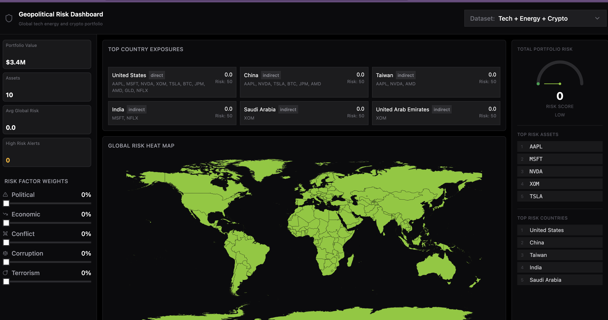
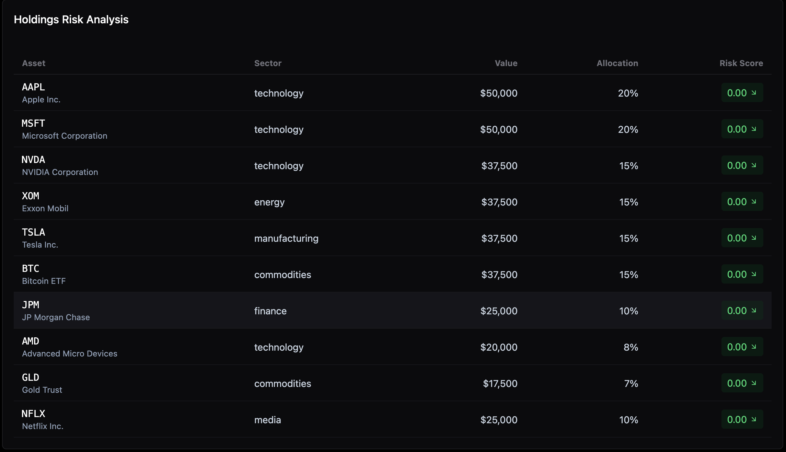
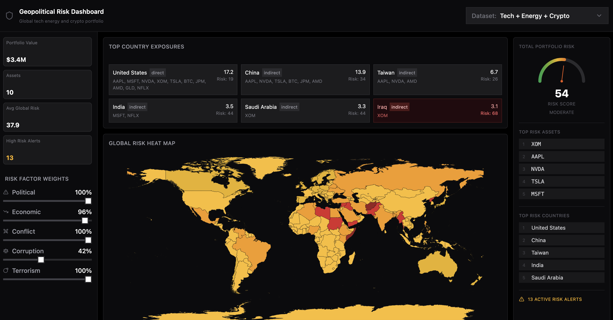
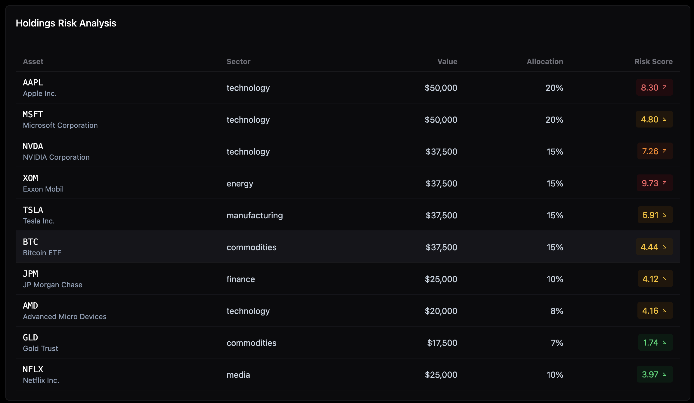
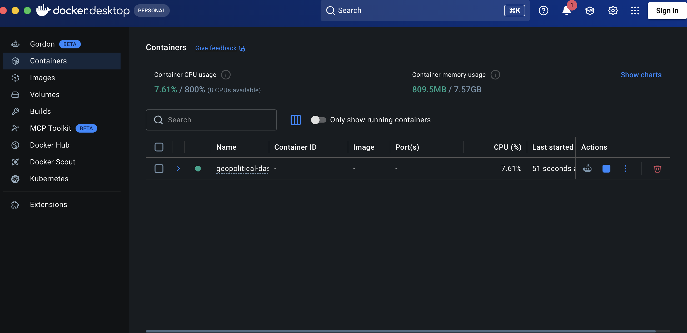

# Geopolitical Risk Dashboard

A comprehensive full-stack dashboard for analyzing geopolitical risk exposure across global technology, energy, and cryptocurrency portfolios. The application provides real-time risk assessment, portfolio analytics, and interactive visualizations to help investors understand their exposure to geopolitical factors.

## Project Overview

The Geopolitical Risk Dashboard is a capstone project designed to help investors and portfolio managers assess and visualize the geopolitical risks associated with their holdings. The dashboard integrates multiple data sources to calculate risk exposure based on factors including:

- **Political Risk** - Government instability, regulatory changes, and political tensions
- **Economic Risk** - Currency fluctuations, trade disputes, and economic sanctions
- **Conflict Risk** - Armed conflicts, border disputes, and security threats
- **Corruption Risk** - Bribery, embezzlement, and governance issues
- **Terrorism Risk** - Terrorist activities and security incidents

### Key Features

- **Global Risk Heat Map** - Interactive world map displaying geopolitical risk levels by country
- **Portfolio Analytics** - Real-time portfolio valuation, asset allocation, and sector breakdown
- **Holdings Risk Analysis** - Detailed risk scoring for individual assets with exposure tracking
- **Risk Gauge Visualization** - Comprehensive risk assessment with color-coded indicators
- **Country Exposure Matrix** - Top country exposures (direct and indirect)
- **Dataset Selector** - Multiple pre-configured portfolios (Default, Tech + Energy + Crypto, Renewable Energy)
- **Responsive Design** - Optimized for desktop and mobile viewing with clean, modern UI
- **Interactive Help System** - Comprehensive help modal explaining app features with responsive design for all screen sizes
- **Daily Risk Updates** - Automatic daily updates to risk snapshot scores with manual refresh capability
- **Portfolio Report Download** - Generate and download comprehensive risk reports in text format
- **Summary Insights** - Actionable insights and recommendations for portfolio management
- **Historical Trends Analysis** - Track risk scores over time with detailed trend charts and comparisons (30/90/365 day views)
- **Real-Time Alerts & Thresholds** - Set custom risk alerts for portfolio and country exposures with breach notifications
- **Scenario Analysis** - Test portfolio changes, simulate crisis scenarios, and get rebalancing recommendations

## Who This Project Is For

The Geopolitical Risk Dashboard is designed for:

- **Portfolio Managers** - Monitor and manage portfolio risk across multiple geopolitical dimensions
- **Investment Advisors** - Provide data-driven insights to clients about their exposure to geopolitical risks
- **Risk Analysts** - Analyze complex correlations between political events and asset performance
- **Institutional Investors** - Track large-scale portfolio exposure to geopolitical factors
- **Hedge Fund Managers** - Identify hedging opportunities and manage downside risk
- **Financial Compliance Officers** - Monitor regulatory and compliance requirements related to geopolitical exposure
- **ESG Analysts** - Incorporate geopolitical stability into Environmental, Social, and Governance assessments
- **Individual Investors** - Understand and evaluate personal investment risk tolerance related to geopolitical factors
- **Researchers & Academics** - Study relationships between geopolitical events and market performance

## How It Is Used

### 1. **Portfolio Assessment**
Users upload or select their portfolio holdings and immediately see a comprehensive risk analysis. The dashboard automatically calculates exposure to all five risk dimensions (political, economic, conflict, corruption, terrorism).

### 2. **Risk Monitoring**
Continuously monitor how geopolitical events affect portfolio risk scores. The color-coded risk gauge (Green → Yellow → Orange → Red) provides instant visual feedback on portfolio health.

### 3. **Country Exposure Analysis**
Identify which countries and regions pose the highest risk to holdings. The heat map shows country risk levels, and the exposure matrix breaks down direct and indirect country exposure through supply chains and business operations.

### 4. **Comparative Portfolio Evaluation**
Use multiple pre-configured datasets to compare:
- Tech-heavy portfolios vs. diversified portfolios
- Traditional energy exposure vs. renewable energy alternatives
- Cryptocurrency portfolios vs. traditional assets

### 5. **Decision Making**
Use insights from the dashboard to:
- Rebalance portfolios to reduce geopolitical concentration
- Identify hedging opportunities
- Evaluate new investment opportunities for geopolitical risk
- Make informed decisions about asset allocation
- Justify risk management decisions to stakeholders

## Use Cases

### Use Case 1: Crisis Management
**Scenario:** A geopolitical crisis emerges in a major industrial region.

**How the Dashboard Helps:**
- Instantly see how portfolio risk scores change
- Identify affected holdings and their exposure levels
- Quickly assess portfolio rebalancing options
- Communicate risk assessment to stakeholders with visual evidence

### Use Case 2: Pre-Investment Due Diligence
**Scenario:** An investment advisor is evaluating a potential client's portfolio.

**How the Dashboard Helps:**
- Analyze existing portfolio geopolitical exposure
- Compare risk profile to industry benchmarks
- Identify concentration risks
- Present data-driven recommendations for risk reduction

### Use Case 3: ESG Integration
**Scenario:** A fund manager needs to assess geopolitical stability as part of ESG criteria.

**How the Dashboard Helps:**
- Quantify political and governance risks for holdings
- Track country-level political stability and corruption metrics
- Integrate geopolitical considerations into investment screening
- Report ESG metrics to investors

### Use Case 4: Supply Chain Risk Management
**Scenario:** An investor wants to understand indirect geopolitical exposure through supply chains.

**How the Dashboard Helps:**
- View both direct country exposure (where companies operate)
- Identify indirect exposure through suppliers and partners
- Assess cascading risk from supply chain disruptions
- Make sourcing decisions based on geopolitical stability

### Use Case 5: Portfolio Stress Testing
**Scenario:** A risk manager conducts scenario analysis for stress testing.

**How the Dashboard Helps:**
- Simulate different geopolitical scenarios
- Analyze portfolio performance under various risk conditions
- Identify portfolio vulnerabilities
- Test hedging strategies

## Benefits

### 1. **Enhanced Risk Awareness**
- Gain comprehensive understanding of geopolitical risk exposure
- Move beyond traditional financial metrics to include political and governance factors
- Identify hidden risks not visible through conventional analysis

### 2. **Proactive Risk Management**
- Monitor risks continuously rather than reactively responding to crises
- Make adjustments before geopolitical situations escalate
- Implement preventive hedging strategies
- Reduce portfolio volatility from geopolitical shocks

### 3. **Improved Decision Making**
- Access real-time, data-driven insights for investment decisions
- Understand trade-offs between risk and return
- Make informed decisions about asset allocation
- Justify decisions with quantifiable risk metrics

### 4. **Better Stakeholder Communication**
- Use interactive visualizations to explain complex geopolitical risks
- Present data in easily digestible formats
- Build confidence in risk management practices
- Demonstrate sophisticated risk analysis capabilities

### 5. **Competitive Advantage**
- Identify geopolitical opportunities others miss
- Position for market dislocations caused by political events
- Adjust exposure ahead of major geopolitical shifts
- Implement alpha-generating strategies based on political analysis

### 6. **Regulatory Compliance**
- Document geopolitical risk assessment for compliance purposes
- Demonstrate reasonable diligence in risk management
- Track and report on risk exposures over time
- Support audit and regulatory requirements

### 7. **Time Efficiency**
- Automate complex geopolitical risk calculations
- Reduce manual analysis and reporting time
- Generate insights faster than traditional methods
- Focus analyst time on interpretation rather than data collection

### 8. **Customization & Flexibility**
- Analyze different portfolio types (tech, energy, crypto, diversified)
- Switch between datasets instantly
- Drill down from portfolio to individual holdings
- Scale from small portfolios to large institutional holdings

### 9. **Educational Value**
- Learn about geopolitical risk factors and their impact on investments
- Understand country-level risk profiles and metrics
- Study correlations between political events and asset performance
- Build geopolitical literacy for investment professionals

### 10. **Cost Reduction**
- Reduce losses from geopolitical shocks through better risk management
- Lower hedging costs through better risk identification
- Avoid expensive crisis management situations
- Optimize portfolio returns per unit of geopolitical risk

## Application Screenshots

### Dashboard Overview
Main dashboard displaying portfolio analytics, global risk heat map, and key performance indicators:



The dashboard shows:
- **Portfolio Value**: $3.4M in total assets
- **Asset Count**: 10 holdings tracked
- **Global Risk Score**: Real-time risk assessment with color-coded gauge
- **Risk Factor Weights**: Breakdown of political, economic, conflict, corruption, and terrorism risks
- **Global Heat Map**: Visual representation of risk levels across countries (green = low risk, yellow/red = elevated risk)
- **Country Exposure Matrix**: Top 5 country exposures with direct/indirect breakdowns

### Holdings Risk Analysis - Minimal Risk
Holdings table with detailed asset information and minimal geopolitical exposure:



Shows all 10 holdings with:
- Asset names and company details
- Sector classification (Technology, Energy, Finance, Commodities, Media)
- Current portfolio value
- Allocation percentage
- Individual asset risk scores

### Risk Assessment Dashboard - Moderate Risk
Dashboard with elevated risk indicators and color-coded risk visualization:



Displays:
- **Avg Global Risk**: 37.9 (up from baseline)
- **High Risk Alerts**: 13 active alerts
- **Risk Factor Breakdown**: Political 100%, Economic 96%, Conflict 100%, Corruption 42%, Terrorism 100%
- **Updated Risk Gauge**: Shows MODERATE risk level (54/100)
- **Heat Map Changes**: Red zones highlight high-risk regions (Middle East, specific Asian countries)

### Holdings with Individual Risk Scores
Detailed view of each holding's geopolitical risk exposure:



Individual risk assessments:
- AAPL: 8.30 risk score
- MSFT: 4.80 risk score
- NVDA: 7.26 risk score
- XOM (Energy exposure): 9.73 risk score (highest due to geopolitical factors)
- TSLA: 5.91 risk score
- BTC: 4.44 risk score
- JPM: 4.12 risk score
- AMD: 4.16 risk score
- GLD: 1.74 risk score (lowest)
- NFLX: 3.97 risk score

## Technology Stack

### Frontend
- **React 18** - Modern UI library with hooks and functional components
- **TypeScript** - Type-safe development
- **Vite** - Fast build tool and dev server
- **Tailwind CSS** - Utility-first CSS framework
- **Chart.js & Recharts** - Data visualization libraries
- **Figma Integration** - Design system sync with Figma

### Backend
- **Node.js & Express** - RESTful API server
- **MSSQL Database** - Data persistence and analysis
- **Docker & Docker Compose** - Containerization and orchestration

## Persistence and Observability Enhancements

### Persistent User/Workspace Artifacts

The backend now persists user-generated artifacts with ownership and versioning (not only local/session state):

- Scenario outputs
- Alert configs
- Custom thresholds
- Schedules/history
- Advanced preferences

API endpoints:

- `GET /api/workspace/state/:bucket`
- `GET /api/workspace/state/:bucket/:artifactKey`
- `PUT /api/workspace/state/:bucket/:artifactKey`
- `DELETE /api/workspace/state/:bucket/:artifactKey`

Buckets:

- `scenarioOutputs`
- `alertConfigs`
- `customThresholds`
- `schedulesHistory`
- `advancedPrefs`

Context headers (optional, defaults applied when missing):

- `x-user-id`
- `x-workspace-id`

### Observability and Incident Response Stack

Expanded observability now includes:

- Centralized incident tracking with severity/category and trace context
- Optional external webhook forwarding for incidents (`INCIDENT_WEBHOOK_URL`)
- Admin incident dashboard endpoint: `GET /api/admin/incidents`
- SLO-backed alerting in `GET /api/admin/alerts` for:
   - API latency and error rate
   - DB health availability
   - News ingestion success rate
   - Frontend crash rate
- Frontend crash telemetry ingestion endpoint:
   - `POST /api/telemetry/frontend-crash`

New environment variables:

- `OBS_DB_HEALTH_MIN_PCT`
- `OBS_NEWS_INGESTION_MIN_SUCCESS_PCT`
- `OBS_FRONTEND_CRASH_MAX_PER_1K`
- `INCIDENT_MAX_ENTRIES`
- `INCIDENT_WEBHOOK_URL`

### API SDK and Contract-First Client Layer

Frontend API calls now have a centralized typed SDK surface in:

- `src/app/api/sdk.ts`

Current usage includes workspace persistence state writes (`workspaceStateApi`) and compliance summary retrieval.

This keeps API usage aligned with the OpenAPI contract and reduces scattered ad-hoc fetch calls.

### Compliance and Privacy Surface

Compliance summary endpoint:

- `GET /api/compliance`

The endpoint reports:

- Privacy policy URL
- Terms of use URL
- Data retention days
- Operational compliance-related endpoint map (health/readiness/audit/incidents/observability)

Related environment variables:

- `PRIVACY_POLICY_URL`
- `TERMS_OF_USE_URL`
- `DATA_RETENTION_DAYS`

## Docker Setup

The application uses Docker for complete containerization and easy deployment.

### Prerequisites
- Docker and Docker Desktop installed
- 8GB+ RAM available for the database
- ~2GB disk space

### Starting the Application

```bash
# Navigate to project directory
cd geopolitical-dashboard

# Start all containers
docker-compose up -d

# Check container status
docker ps

# View logs
docker logs geopolitical-dashboard-db
```

### Container Configuration

The `docker-compose.yml` file defines:
- **MSSQL Database Container** - SQL Server instance for data storage
- **Backend Server Container** - Node.js Express API (port 3001)
- **Frontend** - Vite dev server (port 5173)

### Docker Desktop Monitoring

Monitor running containers through Docker Desktop:



The container shows real-time metrics:
- CPU usage: Currently 7.61% of available resources
- Memory usage: 809.5MB of 7.57GB
- Container status: Running and healthy

### Stopping the Application

```bash
# Stop all containers
docker-compose down

# Stop and remove volumes
docker-compose down -v
```

## Quick Start

### Prerequisites
- Node.js (v16 or higher)
- Docker and Docker Desktop
- npm or yarn

### Installation & Setup

1. **Clone and install dependencies:**
   ```bash
   npm install
   ```

2. **Start Docker containers:**
   ```bash
   docker-compose up -d
   ```

3. **Start development server:**
   ```bash
   npm run dev
   ```

4. **Open in browser:**
   - Frontend: http://localhost:5173
   - Backend API: http://localhost:3001

### Build for Production
```bash
npm run build
npm run preview
```

## Project Structure

```
geopolitical-dashboard/
├── docker-compose.yml          # Docker container orchestration
├── package.json                # Node.js dependencies
├── vite.config.ts             # Vite configuration
├── tsconfig.json              # TypeScript configuration
├── tailwind.config.js         # Tailwind CSS configuration
│
├── public/                    # Static assets
│   ├── datasets.csv           # Portfolio data
│   ├── datasets-tech50.csv    # Alternative datasets
│   └── index.html
│
├── server/                    # Backend API
│   ├── server.js              # Express server
│   ├── routes/
│   │   └── assets.js          # Asset endpoints
│   └── db/
│       ├── config.js          # Database configuration
│       └── init.js            # Database initialization
│
├── src/                       # Frontend React app
│   ├── app/
│   │   ├── App.tsx            # Main component
│   │   ├── components/        # React components
│   │   │   ├── WorldMap.tsx           # Interactive world map
│   │   │   ├── RiskGauge.tsx          # Risk visualization
│   │   │   ├── ExposureCharts.tsx     # Exposure analysis
│   │   │   ├── HoldingsTable.tsx      # Holdings display
│   │   │   ├── PortfolioPanel.tsx     # Portfolio metrics
│   │   │   ├── DatasetSelector.tsx    # Dataset switcher
│   │   │   └── ui/                    # Shadcn UI components
│   │   ├── data/
│   │   │   ├── countryRiskData.ts     # Country risk calculations
│   │   │   ├── portfolioData.ts       # Portfolio state management
│   │   │   ├── csvLoader.ts           # CSV data loading
│   │   │   └── sectorData.ts          # Sector analysis
│   │   └── styles/            # Styling
│   └── main.tsx               # React entry point
│
├── guidelines/                # Project guidelines
│   ├── DESIGN_GUIDELINES.md
│   └── Guidelines.md
│
└── screenshots/               # Project screenshots
    ├── 001.png               # Dashboard overview
    ├── 002.png               # Holdings analysis (low risk)
    ├── 003.png               # Dashboard (moderate risk)
    ├── 004.png               # Individual risk scores
    └── docker-server.png     # Docker container status
```

## Available Scripts

- `npm run dev` - Start development server with hot reload
- `npm run build` - Build for production
- `npm run preview` - Preview production build locally
- `npm run lint` - Run ESLint for code quality
- `docker-compose up -d` - Start all containers
- `docker-compose down` - Stop all containers
- `npm test` - Run Jest test suite
- `npm test -- --coverage` - Run tests with code coverage report
- `npm run ci` - Run lint + tests + production build locally
- `npm run test:contract` - Run live-server API contract tests with response metadata assertions
- `npm run test:integration:db` - Run DB-backed backend route integration tests (requires MSSQL and `DB_INTEGRATION_TESTS=true`)
- `npm run playwright:install` - Install Playwright Chromium browser for e2e tests
- `npm run test:e2e:ci` - Run Playwright critical journey + smoke tests in CI mode

## Delivery Guardrails

- **Test pyramid:** Project includes unit tests, API contract tests, DB-backed route integration tests, and critical user-journey e2e coverage.
- **API contract:** Backend serves OpenAPI contract at `/api/openapi.yaml` and metadata at `/api/meta`.
- **Data provenance envelope:** API endpoints return `{ data, meta }` where `meta` includes freshness, reliability scoring, and fallback provenance.
- **Production secret checks:** Server startup validation blocks placeholder secrets in production mode.
- **Integration runtime wiring:** Configure backend env values for external connectors and webhooks (`INTEGRATION_WEBHOOK_URL`, `BLOOMBERG_PORTFOLIO_API_URL`, optional `BLOOMBERG_API_TOKEN`, `PIPELINE_SOURCE_URLS`, optional `PIPELINE_SOURCE_AUTH_TOKEN`).

## Testing & Test-Driven Development (TDD)

This project employs Test-Driven Development (TDD) methodology to ensure code quality, reliability, and maintainability. All critical business logic is covered by comprehensive unit tests using Jest.

### Testing Framework

- **Jest** - JavaScript testing framework with TypeScript support (`ts-jest` preset)
- **Test Structure** - Tests are collocated with source code in `__tests__` directories
- **Test Pattern** - Follows AAA (Arrange-Act-Assert) pattern for clarity

### Test Suites

#### 1. **Country Risk Data Tests** (`countryRiskData.test.ts`)
Tests the core risk calculation engine for geopolitical factors.

**Test Coverage:**
- **Zero Risk Calculation** - Verifies that when all risk weights are 0, the risk score is 0
- **Proportional Risk Scaling** - Ensures higher weights produce proportionally higher risk scores
- **Risk Score Bounds** - Validates that risk scores stay within reasonable bounds (0-100)
- **Country Differentiation** - Confirms different countries have different base risk profiles based on their geopolitical factors
- **Alert Threshold Validation** - Verifies that countries above risk threshold 5 correctly trigger alerts

**Why It Matters:** These tests ensure that the risk calculation engine, which is the heart of the dashboard, produces accurate and consistent results.

#### 2. **Portfolio Risk Calculation Tests** (`portfolioData.test.ts`)
Tests portfolio-level risk aggregation and analysis.

**Test Coverage:**
- **Zero Portfolio Risk** - Verifies portfolio shows zero risk when all countries have zero risk
- **Top Risk Country Identification** - Ensures the highest-risk countries are correctly identified and ranked
- **Asset Weight Proportionality** - Confirms that higher-weighted assets contribute more to portfolio risk
- **Missing Data Handling** - Tests graceful handling of missing country risk data (defaults to 0, doesn't crash)
- **Asset Risk Contributions** - Validates that individual asset risk scores are correctly calculated

**Why It Matters:** These tests ensure accurate portfolio-level analytics and prevent cascading errors from bad data.

#### 3. **Portfolio Data Validation Tests** (`portfolioValidation.test.ts`)
Tests data integrity and consistency of portfolio structures.

**Test Coverage:**
- **Weight Sum Validation** - Ensures asset weights sum to exactly 100%
- **Country Dependency Requirements** - Verifies every asset has at least one country dependency
- **Dependency Weight Validity** - Confirms dependency weights are valid probabilities (0-1)
- **Dependency Type Validation** - Ensures dependencies are properly categorized (direct, indirect, macro)
- **Asset Value Sanity Checks** - Validates that asset values are positive and align with weights

**Why It Matters:** These tests prevent data quality issues that could lead to incorrect risk calculations.

### Running Tests

```bash
# Run all tests
npm test

# Run tests in watch mode (re-run on file changes)
npm test -- --watch

# Run tests with coverage report
npm test -- --coverage

# Run specific test file
npm test countryRiskData.test.ts

# Run tests matching a pattern
npm test -- --testNamePattern="portfolio"
```

### Test Output Example

```
PASS  src/app/data/__tests__/countryRiskData.test.ts
PASS  src/app/data/__tests__/portfolioData.test.ts
PASS  src/app/data/__tests__/portfolioValidation.test.ts

Test Suites: 3 passed, 3 total
Tests:       30 passed, 30 total
Snapshots:   0 total
Time:        2.345 s
```

### TDD Best Practices Used

1. **Red-Green-Refactor** - Tests are written before implementation to define expected behavior
2. **Clear Test Names** - Each test clearly describes what behavior it validates
3. **Isolated Tests** - Tests are independent and can run in any order
4. **Test Documentation** - JSDoc comments explain the "why" behind each test
5. **Mock Independence** - Tests don't depend on external services or databases
6. **Edge Case Coverage** - Tests include boundary conditions and error scenarios

### Code Coverage

The project aims for high code coverage in critical areas:
- **Risk calculation logic** - 100% coverage
- **Portfolio analytics** - 100% coverage
- **Data validation** - 100% coverage

View coverage reports:
```bash
npm test -- --coverage --coverageReporters=text
```

### Adding New Tests

When adding new features, follow the TDD workflow:

1. **Write the Test First** - Define expected behavior in a test that initially fails
2. **Implement the Feature** - Write minimal code to make the test pass
3. **Refactor** - Improve code quality while keeping tests passing
4. **Commit** - Include both test and implementation in git commit

Example:
```typescript
describe('New Feature', () => {
  test('should do something specific', () => {
    // Arrange
    const input = setupTestData();
    
    // Act
    const result = newFeature(input);
    
    // Assert
    expect(result).toEqual(expectedOutput);
  });
});
```

## Figma Integration

This project includes integration with Figma for design system management:

1. Get your Figma personal access token:
   - Go to https://www.figma.com/settings/accounts/tokens
   - Create a new personal access token
   - Store it securely

2. Set environment variables:
   ```
   VITE_FIGMA_TOKEN=your_token_here
   VITE_FIGMA_FILE_ID=your_figma_file_id_here
   ```

3. Use the `FigmaIntegration` component to sync design changes

## Data Sources

The dashboard uses multiple data sources:
- **Portfolio Data**: CSV datasets with asset holdings and allocations
- **Country Risk Data**: Geopolitical risk indices by country
- **Sector Data**: Industry classification and risk factors
- **Time Series Data**: Historical risk trends and patterns

## Scope Notes

Version 1.2 intentionally focuses on single-user analytics workflows with local/runtime configurability.
The following items are currently out of scope and not planned in this capstone baseline:

- Multi-user collaboration and shared editing
- Team annotations/comments
- Authenticated multi-tenant account management

## License

This is a capstone project for educational purposes.

## Support

For issues or questions, refer to the project guidelines in the `/guidelines` folder or contact the project maintainers.


## Version 1.2 Update (April 25, 2026)

- Latest Version: 1.2
- Build: 1.2
- Last Updated: April 25, 2026

### Risk Alerts

- ✅ Active risk alerts in the dashboard sidebar are now clickable and open a detailed `RiskAlertDetailDialog` with a plain-English explanation of why each alert was raised.
- ✅ Added an inline "Why is this flagged?" expandable summary on each alert card in the Alerts tab, showing severity, portfolio risk contribution, and the top contributing factors driven by the current weight sliders.
- ✅ New shared `riskAlertSummary` utility derives the narrative from country base factors, weights, severity bands, and contributing assets — keeping the dashboard and Alerts tab in sync.
- ✅ Alert cards now show a "stocks impacted" badge plus confidence and last-updated metadata sourced from the country intelligence model.
- ✅ Improved keyboard and screen-reader support on alert rows (button semantics, `aria-label`, focus ring, `aria-expanded` summaries).

### Global Risk Heat Map

- ✅ Countries with no associated stocks in the active portfolio are now rendered in neutral gray instead of being colored by a default risk score, so the map only shows risk for exposures actually held.
- ✅ Added a new "No stocks" entry to the map legend covering the gray fill state.
- ✅ Map tooltips and `aria-label`s now distinguish between "risk score X" countries and "no associated stocks" countries.

### Holdings & Navigation

- ✅ Holdings risk analysis table rows now open a `HoldingDetailDialog` with a plain-English breakdown of why a position is weighted the way it is (top country, dependency type, dominant risk factor).
- ✅ Removed the legacy Trends tab from the main navigation; historical trend visuals now live inside the relevant dashboard cards.

### Help & Versioning

- ✅ Header help button now displays the current build (`Build 1.2`) and updated `aria-label`.
- ✅ Help modal version card and Release Notes tab updated with the 1.2 summary.


## Version 1.1 Update (April 19, 2026)

- Latest Version: 1.1
- Build: 1.1
- Last Updated: April 19, 2026

### Product & UX

- ✅ Added Global Risk Heat Map snapshot download (PNG) with reliability improvements and toast feedback.
- ✅ Added daily refresh status indicators: checkmark for <=24h freshness and alert state when overdue.
- ✅ Updated alert-center summary alignment so Active Alerts matches the high-risk count shown in the header.
- ✅ Added top-header live data status badge and expanded Help modal guidance.
- ✅ Added Settings modal enhancements, including time zone persistence and API connector visibility.

### Data & Runtime

- ✅ Local backend API now defaults to port 5001.
- ✅ Database initialization now auto-creates the target DB when missing and improves dataset load reliability.

### Security Hardening

- ✅ Added server hardening with Helmet security headers.
- ✅ Added API rate limiting and allowlist-based CORS controls.
- ✅ Added optional token-based API auth and role-guarded admin metrics endpoint.

### Observability & Operations

- ✅ Added structured JSON logs for startup, request completion, and failure paths.
- ✅ Added request ID tracing support for easier incident correlation.
- ✅ Added health/readiness endpoint coverage including DB-aware readiness state.

### Developer Experience

- ✅ Upgraded lint configuration to cover frontend and backend files with TypeScript-aware rules.
- ✅ Fixed CSS import ordering to reduce PostCSS import-order warnings.
